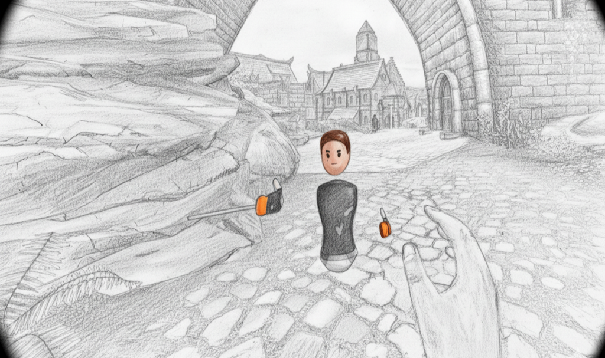
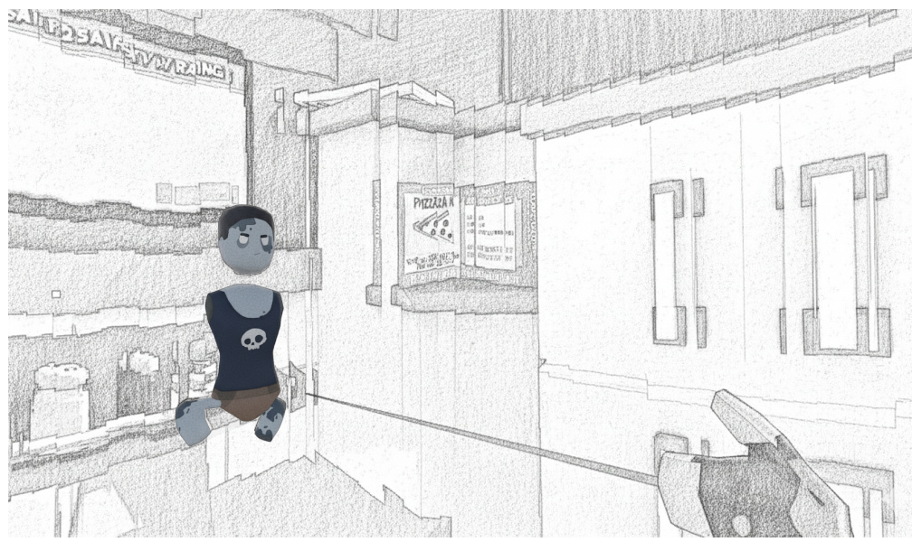
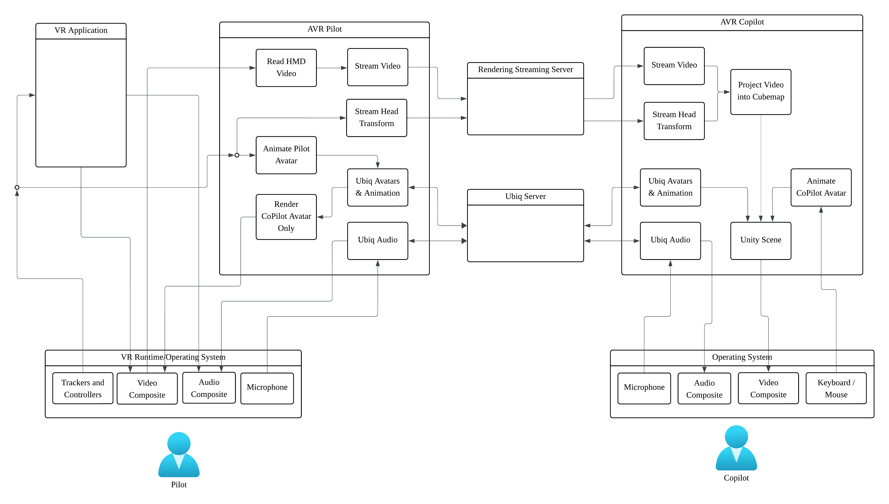

# AccompliceVR


**AccompliceVR** is a remote streaming and collaboration system built on the **Ubiq framework**. It allows for synchronized interaction and viewport sharing between a Pilot and a Copilot in a Virtual Reality environment. For more information, see Ubiq's [documentation](https://ucl-vr.github.io/ubiq/) and [website](https://ubiq.online). AccompliceVR currently uses Ubiq [v1.0.0-pre.16](https://github.com/UCL-VR/ubiq/releases/tag/unity-v1.0.0-pre.16).

The system architecture is shown here:




### 🛠 System Requirements

- **Unity Version:** LTS 2022.3.16
    
- **Dependencies:** Ubiq Framework
    
- **Platform:** Windows (PCVR / Desktop)
    

---

## 🚀 Deployment Guide

The system uses a **Signaling Server** to bridge the connection between the Pilot (Streamer) and the Copilot (Receiver).

### Phase 1: Pilot Side (Streamer)

#### 1. Start the Signaling Server

Before launching Unity, you must start the webserver to manage the stream handshake.

1. Open the **Windows Command Prompt (CMD)**.
    
2. Navigate to the project’s root directory.
    
3. Start the server by running:
    
    Bash
    
    ```
    webserver.exe -p 8080
    ```
    
    _(Note: `-p` sets the port. If 8080 is occupied, try another port.)_
    
4. **Note your IP Address:** The console will display your local IP (e.g., `192.168.12.170`). Provide this address to the Copilot user.
    

#### 2. Unity Configuration

1. Open the project and load the **AVRPilot** scene from `Assets/Scenes`.
    
2. In the **Hierarchy**, select the **Streamer/streaming** GameObject.
    
3. In the **Inspector**, find the **Signaling Manager** component and click **"Open Project Settings"**.
    
4. Set the **Signaling Type** to `WebSocket`.
    
5. Enter the localhost URL in the URL field: `ws://127.0.0.1:8080`.
    
6. Press **Play** or build as a Windows Executable.
    

---

### Phase 2: Copilot Side (Receiver)

1. Open the project and load the **AVRCopilot** scene from `Assets/Scenes`.
    
2. In the **Hierarchy**, select the **VideoReceiver** GameObject.
    
3. In the **Inspector**, find the **Signaling Manager** component and click **"Open Project Settings"**.
    
4. In the URL field, enter the **Pilot’s IP address**:
    
    - Example: `ws://192.168.12.170:8080`
        
5. Press **Play** or run the Windows Executable to begin the session.
    

---

## 🎮 Copilot Controls

The Copilot can interact with the environment and guide the Pilot using the following inputs:

|**Action**|**Key / Input**|
|---|---|
|**Movement**|`W` `A` `S` `D`|
|**Lock/Unlock Viewport**|`F` (Syncs to the latest frame)|
|**Rotate Viewport**|`Right Click` + `Mouse Movement`|
|**Point Laser**|`Ctrl` + `Mouse Movement`|
|**Toggle Laser**|`R` (Show/Hide laser on right hand)|
|**Reset/Clear Skybox**|`Spacebar`|

---

## 📄 Reference & Citation

For detailed information regarding the system architecture and experimental results, please refer to our paper:

> **[Insert Full Paper Title and Authors Here]**
